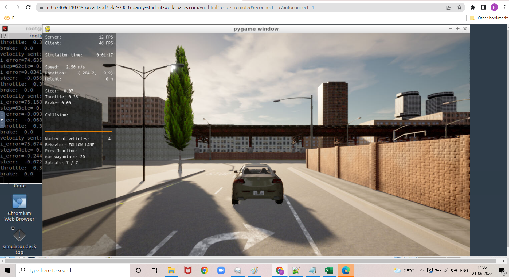
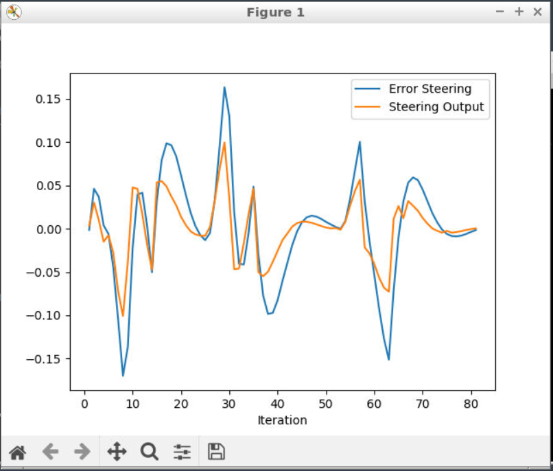
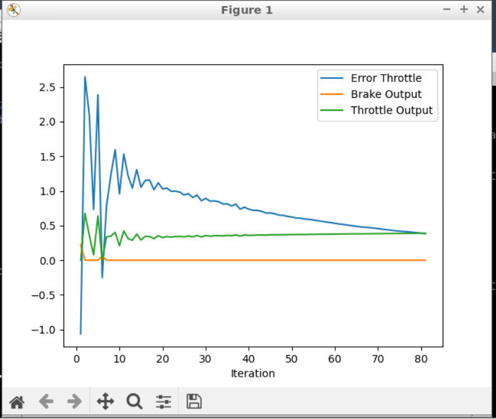

# **Control and Trajectory Tracking for Autonomous Vehicle**

**Summary:**
The project is a to develop a model free Proportional-Integral Derivative (PID) controller that handles the throttle and steer of an autonomous vehicle based of feedback from vehicle data and the error in steer & throttle with reference to the planned trajectory.

**Instructions to run the code:**
Run Carla Simulator
Open new window

-   `su - student`  // Will say permission denied, ignore and continue
-   `cd /opt/carla-simulator/`
-   `SDL_VIDEODRIVER=offscreen ./CarlaUE4.sh -opengl`
## Compile and Run the Controller

Open new window

-   `cd nd013-c6-control-starter/project`
-   `./install-ubuntu.sh`
-   `cd pid_controller/`
-   `rm -rf rpclib`
-   `git clone https://github.com/rpclib/rpclib.git`
-   `cmake .`
-   `make`  (This last command compiles your c++ code, run it after every change in your code)
## Testing

To test your installation run the following commands.

-   `cd nd013-c6-control-starter/project`
-   `./run_main_pid.sh`  This will silently fail  `ctrl + C`  to stop
-   `./run_main_pid.sh`  (again) Go to desktop mode to see CARLA

**PID tuning:**
Multiple combinations were tried before finalizing the PID values for steer and throttle.
The plots of error vs controller output for steer and throttle were used to fine tune the PID values. 

First the P value coefficient was tuned. P value is the proportional to current error. We keep increasing P coefficient until it control output plot  overshoots the error plot. Then we half the P coefficient value and use this P coefficient value for tuning. 

The I coefficient value is increased so the the plot of the control output is close to the error, if I coefficient is too high the control output fits too close to the error. The D coefficient value is chosen at last so that the control output plot doesn't overshoot the error output.

The P value proportional to current error between planned trajectory and actual.  
The I value is integral of all the errors with time. With time as the error diminishes the i value stops increasing and also the proportional effect decreases. The D value is the rate of change of current error. The greater the rate of change of current error D values allows for greater controlling or controller effect at that rate of change.

**Test Results**
The Car using the PID Parameters:

**Steer Plot:**
The x-axis is the iterations of the PID controller while the vehicle is running and y-axis is the steer error or control output for steer.

**Throttle Plot:**
The x-axis is the iterations of the PID controller while the vehicle runs and the y-axis is the throttle error, controller output of throttle and controller output of the break.

**How would you design a way to automatically tune the PID parameters?**
The Twiddle algorithm can be used to automatically tune the PID parameters.
The twiddle algorithm is describes by Sebastian Thurn in the course. 

**PID controller is a model free controller, i.e. it does not use a model of the car. Could you explain the pros and cons of this type of controller?
Find at least 2 pros and cons for model free versus model based.**

The model based controllers might produce good performance on the known scenarios
compared to the model free controller. Whereas the model free controller is more generalizable to un-known new scenarios too.

The development time might be reduced with a model free controller is it can be tuned to multiple vehicles using the same algorithm.
 

**What would you do to improve the PID controller?**

The PID coefficients for a moderate speed might be different from the PID coefficients for a high speed driving. Hence based on a threshold speeds we could have different set of PID coefficients kick in with some base values chosen on from manual tuning and they auto finetune using Twiddle while running.
